## View Set

 
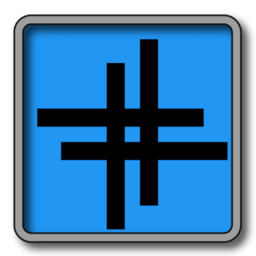 
 
 
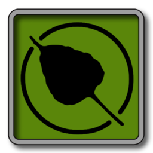 
 
 
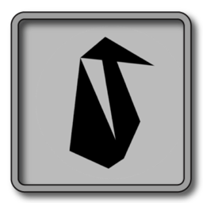 
 
 
 
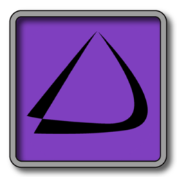 
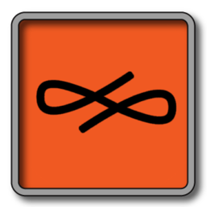 
 
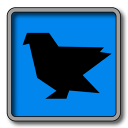 
 
 
 
 
 
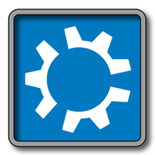 
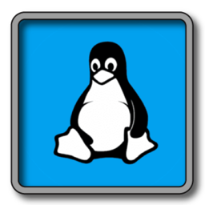 
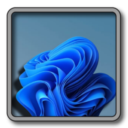 
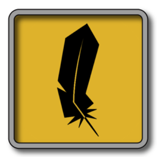 
 
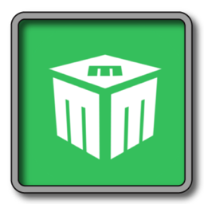 
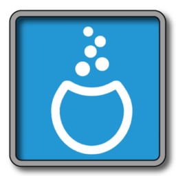 
 
 
 
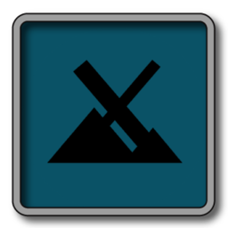 
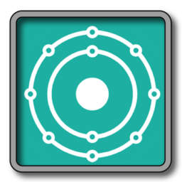 
 
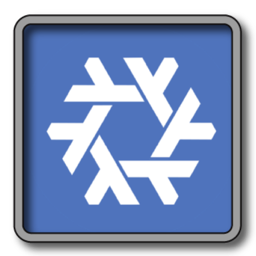 
 
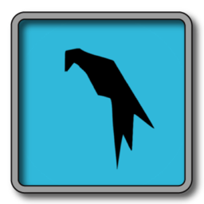 
 
 
 
 
 
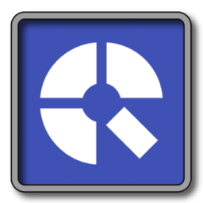  
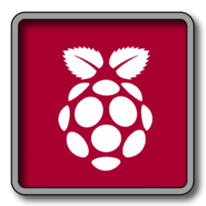 
 
 
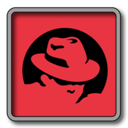 
 
 
 
 
 
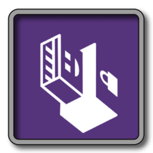 
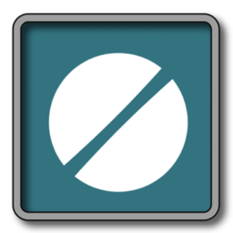 
 
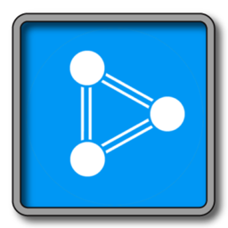 
 
 
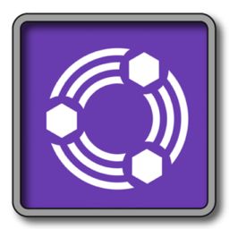 
 
 
 
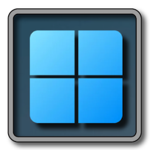 
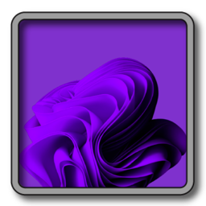 
 
 
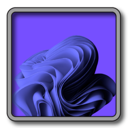 
 
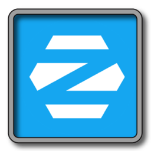 

Return ➤ [Back on Top](https://github.com/chris1111/Linux-Logo-Blue-Grey/blob/main/View-Set-IOS.md#view-set)
